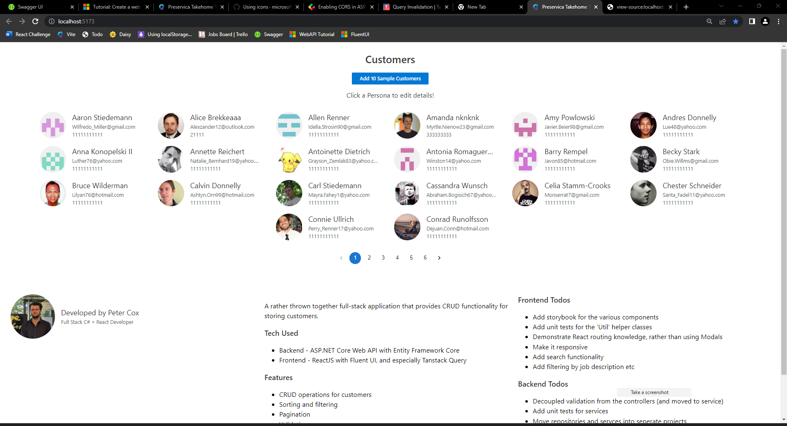

# Fullstack ASP.NET Core + ReactJS + FluentUI Example - By Peter Cox 💥

This project makes uses of NextJs, Optimizely Fullstack and the JS SDK.

## Technologies used

   <!-- C# Icon -->
   

   <!-- React Icon -->
   

   <!-- JS Icon -->

   <!-- TypeScript -->

# How to run the project

1. Clone the project from https://github.com/PeterWCox/PreservicaTakehomeTest
2. Open up 'CustomerDetails.Backend' in VSC
3. Press Ctrl+F5 to run the WebAPI
4. Visit https://localhost:7142/**swagger**/index.html to view the API
   and check it is functional
5. Open up 'CustomerDetails.Frontend' in **VSC**
6. Run "npm i" to install the dependencies
7. Run "npm run dev" to run the frontend
8. Visit "http://localhost:5173/" to view the frontend

Any questions please ring or e-mail me using the details supplied on my CV.
csharp css3 cypress gatsby html5 jasmine javascript jest mocha nextjs nodejs react svelte typescript webpack
